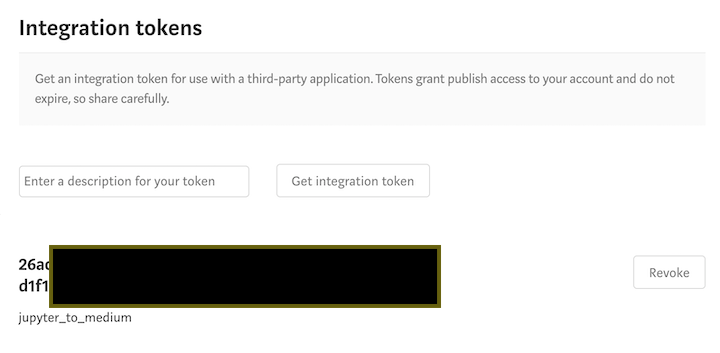
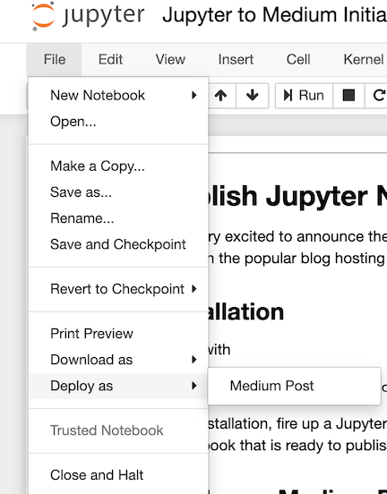
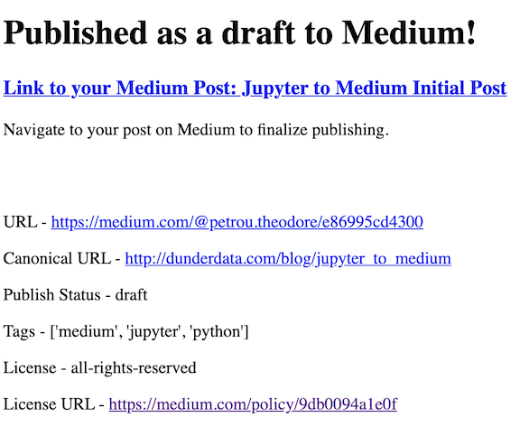

# Jupyter to Medium

[](https://pypi.org/project/jupyter_to_medium)
[](LICENSE)

Publish Jupyter Notebooks as Medium blog posts directly from your notebook with the help of jupyter_to_medium.

## Target User

Do you ....

* Publish blog posts on Medium?
* Use Jupyter Notebooks to write your posts?
* Dislike the time and effort it takes to transfer your posts from Jupyter to Medium?

If so, jupyter_to_medium will automate the process of taking your Jupyter Notebook as is and publishing it as a Medium post in almost no time at all saving huge amounts of time.

## Motivation

I've [published dozens of blog posts on Medium][0] myself with all of them beginning as Jupyter Notebooks. Manually converting them to Medium posts was a fairly lengthy, painstaking process. One particularly painful process was inserting tables, which Medium does not support, into my posts. Nearly all of my posts contain numerous pandas DataFrames ([such as this one][1], which has 40! DataFrames) which are represented as HTML tables within a notebook. I'd take screenshots of each one to insert them into my Medium posts.

[0]: http://medium.com/dunder-data
[1]: https://medium.com/dunder-data/selecting-subsets-of-data-in-pandas-6fcd0170be9c

## Installation

`pip install jupyter_to_medium`

### Automatically activated

You should be able to skip the next step, but if the extension is not showing up in your notebook, run the following command:

`jupyter bundlerextension enable --py jupyter_to_medium._bundler --sys-prefix`

## Get an Integration Token from Medium

Before using this package, you must request an integration token from Medium by emailing them at <a href="mailto:yourfriends@medium.com">yourfriends@medium.com</a> allowing you to create a token in <a href="https://medium.com/me/settings">your Medium settings.</a> You can read the [entire instructions on how to get your integration token](https://github.com/Medium/medium-api-docs#21-self-issued-access-tokens).

### Creating the integration token

Once your request to create integration tokens is accepted, navigate to <a href="https://medium.com/me/settings">your Medium settings.</a> Towards the bottom of the page exists the section on Integration Tokens. Enter a description for the token (`jupyter_to_medium` is a good choice) and then create the token.



### Save your integration token

Once you have your integration token, create the folder and file `.jupyter_to_medium/integration_token` in your home directory and save the token there. If you don't save it, you'll need to access it every time you wish to make a new post.

## Usage

There are three ways to publish notebooks:

* Within an active notebook
* From the command line
* Using a Python script

### Publishing to Medium within a Notebook

After installation, open the notebook you wish to publish and select the option `File -> Deploy as -> Medium Post`



A new browser tab will open with a short form that needs to be completed.


After clicking publish, the notebook and all images will be uploaded to Medium. Any HTML tables (such as pandas DataFrames) will be converted to images (via chrome), as Medium has no ability to represent tables. This is a time consuming process, so be prepared to wait. Check your terminal for updates. If successful, you'll get the following response with a link to view the post.



Click the link to view the post.


#### Finalize and publish on Medium

As of now, your post will be published as a draft. Review and publish the post on Medium.

### Publishing to Medium from the Command Line

Upon installation, you'll have access to the command line program `jupyter_to_medium` with the same options as the above function.

```bash
jupyter_to_medium --pub-name="Dunder Data" "My Awesome Blog Post.ipynb"
```

### Publishing to Medium with a Python Script

In a separate script/notebook import `juptyer_to_medium` as a module. Pass the `publish` function the location of the Jupyter Notebook you would like to publish as a Medium blog post

```python
import jupyter_to_medium as jtm
jtm.publish('My Awesome Jupyter Notebook.ipynb',
            integration_token=None,
            pub_name=None,
            title=None,
            tags=None,
            publish_status='draft',
            notify_followers=False,
            license='all-rights-reserved',
            canonical_url=None,
            chrome_path=None,
            download_markdown=False)
```

If successful, JSON data will be returned as a dictionary with the URL.

## Dependencies

* nbconvert
* requests
* pillow (if you have HTML tables)
* Google Chrome / Brave browser
